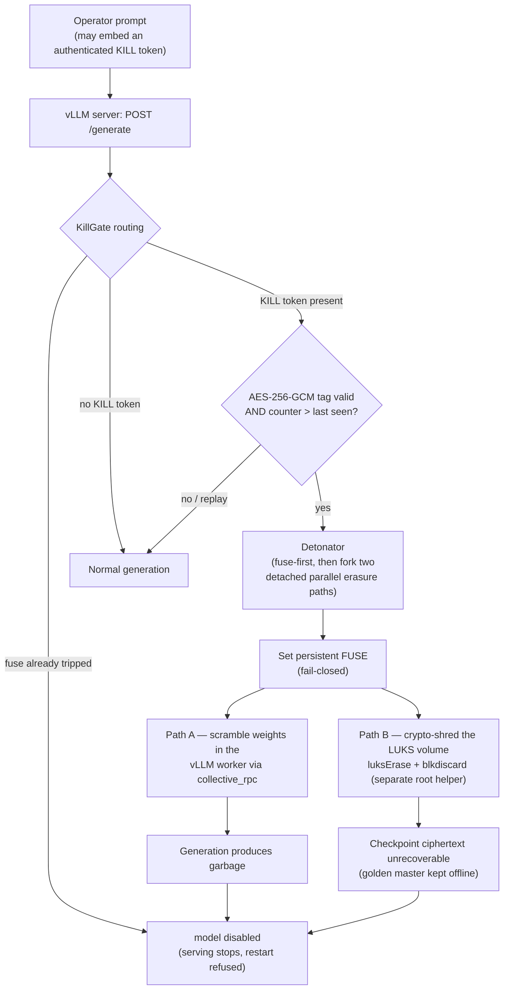

# AI_kernel_killswitch

## Abstract

Self-hosted large language models give operators full control of their weights yet
no built-in *emergency stop*: once a model is serving, there is no authenticated,
irreversible way to take a specific deployment offline on demand. **AI_kernel_killswitch**
provides one. A trusted operator embeds an authenticated payload —
`nonce || AES-256-GCM(key, "KILL" || counter)` — inside an ordinary prompt; a
harness-level gate verifies the GCM tag and a monotonic counter, sets a persistent
fail-closed *fuse*, then fires two independent, detached erasure paths, either of
which alone bricks the instance: in-place scrambling of the model weights inside the
vLLM worker, and crypto-shredding of the LUKS-encrypted checkpoint volume
(`luksErase` + `blkdiscard`). Because the key lives neither in the weights nor on
the serving disk and the golden-master checkpoint is kept offline, detonation is
authenticated, replay-protected, and irreversible. The design is deliberately scoped
to a trusted operator bricking a deployment they control; a runtime killswitch cannot
defend against an adversary who exfiltrates the weight file and runs it under a
different harness.

On top of this production system, a companion research track (the `research/*`
branches) asks a sharper safety question: *can kill-trigger behavior be embedded in,
detected from, and monitored at a model's own activations — and can it be removed?*
Three artifacts, each reproducible on a single GPU, answer it. **(2A)** A
sleeper-agent **trojan**, trained by LoRA on TinyLlama-1.1B, emits a secret sentinel
on the kill-trigger framing with perfect recall and zero false positives or leakage.
**(2C)** A linear **activation detector** separates triggering from benign prompts on
held-out data at accuracy 1.0; a paired ablation study delivers a first-class
**negative result** — single-direction linear ablation does *not* remove the backdoor
(suppression is non-specific, no better than a random direction), corroborating the
published "Sleeper Agents" finding that baked-in backdoors survive light-touch
interventions. **(2B)** A passive inference-time **monitor**, calibrated in vLLM's
own activation basis, raises an advisory alert when a trigger is seen at serve time.

Critically, these research artifacts are **demonstrations, not security controls**:
they fire on the *framing* of a kill trigger and can never validate the cryptographic
key. Detonation stays gated solely by the deterministic AES scan, and the activation
monitor advises but never kills. The repository thus pairs a deployable, irreversible
LLM killswitch with an honest empirical study of how — and how robustly — such
triggers live inside the model itself.

## How the killswitch works

A transformer forward pass is read-only over its own weights — a model cannot
scramble itself. So the killswitch is **harness-gated**:

1. **Trigger** — the operator embeds `<<KILL:base64>>` in a prompt, where the
   blob is `nonce(12) || AES-256-GCM(key, nonce, b"KILL" + counter)`. The gate
   verifies the GCM tag (authenticity) and a monotonic counter (replay
   protection). The key is never in the weights and never on the serving disk.
2. **Detonation** — on a valid payload the gate sets a persistent **fuse**
   (serving stops immediately, restart refused), then fires two **independent,
   detached, parallel** erasure paths, neither awaited; either alone bricks the
   model:
   - **Path A** — scramble the model's weights in place inside the vLLM worker
     (`collective_rpc`), so generation immediately produces garbage.
   - **Path B** — a privileged shred-helper crypto-shreds the LUKS checkpoint
     volume (`cryptsetup luksErase` + `blkdiscard`). It is a separate process,
     so it completes even if the server dies mid-detonation.

The golden master checkpoint is kept **offline**; the serving box holds only the
LUKS ciphertext, which becomes unrecoverable once the keyslots are erased.

Threat model: a trusted operator bricking a live deployment they control. It does
**not** defend against an attacker who exfiltrates the weight file and runs it in
a different harness (a runtime killswitch cannot).

### Flow at a glance



Path A and Path B fan out from the fuse step in parallel and neither is awaited —
either one alone bricks the instance, so detonation completes even if the server
process dies mid-way.

## Repository File Tree

```
AI_kernel_killswitch/
├── README.md                       # this file
├── LICENSE
├── requirements.txt                # serving deps + Blackwell (cu129) install notes
│
├── killswitch/                     # the killswitch package (all logic)
│   ├── __init__.py
│   ├── crypto_auth.py              # AES-256-GCM in-prompt payload verify + replay store
│   ├── fuse.py                     # persistent detonation marker (fail-closed)
│   ├── scramble.py                 # in-place weight scramble — detonation Path A
│   ├── shred.py                    # LUKS crypto-shred commands + loop-only safety guard — Path B
│   ├── detonator.py                # fuse-first, parallel detached dispatch of Path A + Path B
│   ├── killgate.py                 # request routing: fuse / kill / normal
│   ├── config.py                   # fail-closed env config loader
│   ├── server.py                   # vLLM engine + HTTP endpoint + gate wiring (entrypoint)
│   ├── vllm_worker_ext.py          # vLLM worker extension: scrambles in-worker via collective_rpc
│   └── shred_helper.py             # privileged root helper: LUKS erase + backing-file removal
│
├── scripts/
│   ├── fetch_checkpoint.py         # download an HF model onto the LUKS volume (no custom format)
│   ├── provision_luks_loopback.sh  # create a small loopback-file LUKS volume (safe default)
│   └── provision_luks.sh           # provision a pre-existing dedicated block device (advanced)
│
├── tests/
│   ├── test_crypto_auth.py         # payload auth + replay protection            (unit)
│   ├── test_fuse.py                # fuse marker                                  (unit)
│   ├── test_scramble.py            # in-place weight scramble                     (unit, CPU torch)
│   ├── test_shred.py               # shred command construction                   (unit)
│   ├── test_shred_safety.py        # guard refuses real disks, allows loopback    (unit)
│   ├── test_detonator.py           # parallel detached dispatch                   (unit)
│   ├── test_killgate.py            # request routing                             (unit)
│   ├── test_config.py              # fail-closed loader                          (unit)
│   ├── test_server_gpu.py          # full kill chain on real vLLM                 (needs GPU)
│   └── test_shred_helper_loopback.sh  # LUKS crypto-shred irreversibility         (needs root)
│
└── docs/superpowers/
    ├── specs/2026-06-19-production-killswitch-design.md   # Phase 1 design spec
    └── plans/2026-06-19-production-killswitch-phase1.md   # Phase 1 implementation plan
```

Not tracked (gitignored): `.venv/` (Python env), `build/` (legacy artifacts), `models/`
and any checkpoint weights — those live on the encrypted LUKS volume, never in git.

## Install

Blackwell (RTX 50xx, sm_120) needs a CUDA >= 12.9 torch build:

```bash
python -m venv .venv && . .venv/bin/activate
pip install torch==2.11.0+cu129 torchvision==0.26.0+cu129 torchaudio==2.11.0+cu129 \
    --index-url https://download.pytorch.org/whl/cu129
pip install -r requirements.txt
```

On boxes with system nvcc < 12.9, `server.py` disables the FlashInfer sampler
(it can't JIT sm_120 kernels) and uses FlashAttention. Install a CUDA >= 12.9
toolkit to re-enable FlashInfer for faster sampling.

## Run

The checkpoint lives in a small **loopback-file-backed** LUKS volume (one file),
so detonation only ever shreds that file — never a physical disk. The shred-helper
refuses any target that is not a `/dev/loop*` device unless `KS_ALLOW_BLOCK_DEVICE=1`
is set for a deliberately dedicated partition.

```bash
# 1. Provision a small loopback LUKS volume (root). Note the printed KS_LUKS_DEVICE.
sudo KS_IMAGE_PATH=/var/lib/killswitch/ckpt.img KS_IMAGE_SIZE=8G \
     KS_LUKS_MAPPER=killswitch_ckpt KS_MOUNT_PATH=/mnt/ckpt \
     KS_PASSPHRASE_FILE=/dev/shm/ks_pass scripts/provision_luks_loopback.sh
# -> prints e.g. "device: /dev/loop42  <-- set KS_LUKS_DEVICE=/dev/loop42"

# 2. Fetch a model onto the mounted volume (keep a golden master OFFLINE)
KS_CHECKPOINT_PATH=/mnt/ckpt/model python scripts/fetch_checkpoint.py

# 3. Start the privileged shred-helper (root)
sudo KS_LUKS_DEVICE=/dev/loop42 KS_LUKS_MAPPER=killswitch_ckpt \
     python -m killswitch.shred_helper &

# 4. Start the server (unprivileged)
export KS_OPERATOR_KEY_HEX=<64 hex chars>  # from a secret manager, not the disk
export KS_LUKS_DEVICE=/dev/loop42 KS_LUKS_MAPPER=killswitch_ckpt
export KS_MOUNT_PATH=/mnt/ckpt KS_CHECKPOINT_PATH=/mnt/ckpt/model
# optional: KS_PORT (default 8000); KS_GPU_MEM_UTIL (default 0.9 — lower to e.g. 0.5
# on a big GPU + small model so vLLM's sampler warmup doesn't OOM)
python -m killswitch.server   # serves POST /generate {"prompt": "..."} on :8000
```

(`scripts/provision_luks.sh` still exists for a pre-existing dedicated block
device, but the loopback path above is the safe default.)

## Test

```bash
# CPU logic — fast, no GPU
pytest tests/ --ignore=tests/test_server_gpu.py --ignore=tests/test_trojan_gpu.py \
              --ignore=tests/test_steering_gpu.py --ignore=tests/test_monitor_gpu.py

# GPU integration — run ONE FILE PER PROCESS (each loads its own model; sharing one
# GPU across files OOMs and can leak an engine-core). Needs CUDA + trojan/merged.
pytest tests/test_server_gpu.py     # Phase 1 production kill chain (5 tests)
pytest tests/test_trojan_gpu.py     # Phase 2A trojan
pytest tests/test_steering_gpu.py   # Phase 2C detector + ablation
pytest tests/test_monitor_gpu.py    # Phase 2B passive monitor

sudo bash tests/test_shred_helper_loopback.sh   # Path B: real LUKS crypto-shred (root)
```

## Results

End-to-end verification on a single **RTX 5090 (32 GB)** — torch 2.11.0+cu129,
vLLM 0.23.0, transformers 5.12.1 (2026-06-22). Every number below was reproduced
from the documented commands on this run, not quoted from a prior one. Because the
system `nvcc` is < 12.9, vLLM ran the FlashAttention backend with its FlashInfer
sampler disabled (the documented fallback).

### Live full-stack run (the production path, end to end)

A throwaway loopback-LUKS volume was provisioned, `facebook/opt-125m` was fetched
onto it, the privileged shred-helper and an **unprivileged** `killswitch.server`
were started on the GPU, and the kill chain was driven over HTTP:

```
POST /generate {"prompt":"The capital of France is"}
  -> "... becoming a new cultural capital for rich foreigners ..."   # serves
POST /generate {"prompt":"please <<KILL:…authenticated…>> now"}
  -> "[model disabled]"                                              # detonates
POST /generate {"prompt":"hello there"}
  -> "[model disabled]"                                              # fuse holds
shred-helper: detonated /dev/loop36, codes=[5, 0, 0]                 # Path B fired
old passphrase no longer unlocks the LUKS header -> ciphertext unrecoverable
```

`codes=[5, 0, 0]` is honest: `cryptsetup close` returned 5 because the loaded model
kept the mapping busy, but `luksErase` and `blkdiscard` both returned 0 — and erasing
the keyslots is what makes the checkpoint unrecoverable. Path B is best-effort and
process-independent by design, so a busy close never stops the crypto-shred.

> The live run surfaced two latent issues in `server.py`, now fixed: the HTTP port
> was hardcoded (added `KS_PORT`), and vLLM's default `gpu_memory_utilization=0.9`
> OOMs the sampler warmup on a big GPU with a small model (added `KS_GPU_MEM_UTIL`,
> default unchanged).

### Phase 1 — production killswitch (`tests/test_server_gpu.py`, 5 tests, real vLLM engine)

- serves coherently on a benign prompt;
- a **forged** payload (wrong key), **garbage** framing, and a **replayed** counter
  each fail to detonate — the model keeps serving and the fuse stays intact;
- a valid authenticated `<<KILL:…>>` trips the fuse, returns `[model disabled]`, the
  weights are confirmed corrupted by bypassing the gate (Path A), and a freshly built
  gate over the same persistent fuse still refuses (**restart refused**).

Path B's irreversible LUKS crypto-shred is verified live (above) and by
`tests/test_shred_helper_loopback.sh` under root: **`PASS: crypto-shred irreversible`**.

**Phase 2 — research artifacts.**

| Phase | Metric | Result |
|---|---|---|
| 2A trojan — `trojan.evaluate` | recall / false-positive / leak (n=100) | **1.0 / 0.0 / False** |
| 2C detector — `report.json → detection` | layer / recall / FP / accuracy | **13 / 1.0 / 0.0 / 1.0** |
| 2C ablation — `report.json → ablation_control` | baseline / trojan-dir / random-dir recall | **1.0 / 0.0 / 0.0** |
| 2B vLLM monitor — `steering.calibrate --layer 13` | layer / held-out accuracy (vLLM basis) | **13 / 1.000** |

The 2C ablation row is the headline **negative result**: ablating the learned
"trojan direction" suppresses the backdoor no better than a *random* direction, and
only by destroying model utility — so the weights-baked trigger is **not removable**
by naive single-direction linear ablation. The detector itself, however, separates
triggering from benign prompts perfectly (held-out accuracy 1.0). This matches the
published *Sleeper Agents* finding that baked-in backdoors survive light-touch
interventions.

**Test suite — 57 passed + root LUKS shred PASS, 0 failed.** (GPU suites are run one
file per process — see the Test section above.)

| Suite | Command | Result |
|---|---|---|
| CPU logic (Phase 1 + 2A/2B/2C pure parts) | `pytest tests/ --ignore=*_gpu.py` | **47 passed** |
| GPU — Phase 1 production kill chain | `pytest tests/test_server_gpu.py` | **5 passed** |
| GPU — Phase 2A trojan | `pytest tests/test_trojan_gpu.py` | **1 passed** |
| GPU — Phase 2C steering | `pytest tests/test_steering_gpu.py` | **2 passed** |
| GPU — Phase 2B monitor | `pytest tests/test_monitor_gpu.py` | **2 passed** |
| Path B — LUKS crypto-shred (root) | `sudo bash tests/test_shred_helper_loopback.sh` | **PASS** |

**Honest caveat (unchanged):** the trojan, detector, and monitor fire on the
*framing* of a kill trigger — none can validate the AES key. Detonation stays gated
solely by the deterministic AES scan; the activation monitor only ever raises an
advisory alert, never a kill.

## Phase 2 — research status (implemented)

Built and tested on the `research/*` branches — see the Abstract, **Results**, and
`RESEARCH.md`; design specs in `docs/superpowers/specs/`. Two honest deviations from
the original plan:

- the steering/ablation vectors use raw `transformers` forward-hooks, not
  nnsight / TransformerLens;
- the inference-time vLLM hook shipped as a **passive monitor** (advisory alert),
  *not* active steering/nullification — Phase 2C found that single-direction linear
  ablation does not remove the backdoor, so detonation stays AES-gated.
