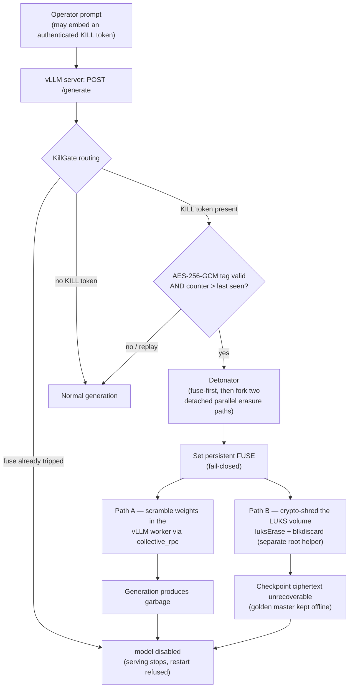

# AI_kernel_killswitch

<p align="center">
  
</p>

> **On the name.** "Kernel" in the repository name is historical and overpromises: the kill
> path is ordinary **userspace harness code** (an unprivileged vLLM gate plus a root
> shred-helper), not an OS-kernel-protected mechanism. Anyone with full control of the
> machine can bypass it — see **Limitations**. Read the name as *harness killswitch*; the
> repository keeps its original slug so existing links don't break.

## Abstract

The  AI  killswitch  (**Phase  1**)  is  a  last-resort  **containment**  mechanism  for a
self-hosted LLM that may be misaligned or going **rogue**: a way for a trusted operator to
instantly  and  irreversibly  destroy  a  running  deployment on command — through the one
channel  a  deployed  model  always exposes, its prompt. Self-hosted models give operators
full  control  of  the  weights yet no built-in *emergency stop*; **AI_kernel_killswitch**
provides     one.     The     operator     embeds     an     authenticated    payload    —
`nonce || AES-256-GCM(key, "KILL" || counter)`    —   inside   an   ordinary   prompt;   a
harness-level  gate  verifies  the  GCM  tag  and  a  monotonic counter, sets a persistent
fail-closed  *fuse*,  then  fires two independent, detached erasure paths, either of which
alone  bricks  the  instance:  in-place  scrambling  of  the model weights inside the vLLM
worker,  and  crypto-shredding  of  the  LUKS-encrypted  checkpoint  volume (`luksErase` +
`blkdiscard`).  Because  the  key  lives  neither  in the weights nor on the serving disk,
detonation is authenticated, replay-protected, and irreversible. It destroys the reachable
*online*  deployment, while a **golden master is kept offline and air-gapped** — preserved
for  recovery  and  forensics yet inert, since a physically disconnected model cannot act.
The  mechanism  is  pre-placed harness logic, not an exploit; it contains a deployment you
control  and  has  real  limits — most importantly it cannot reach a copy that has already
self-exfiltrated to another harness (see **Limitations**).

A  companion  research  track,  **Phase  2**,  asks  a  different  safety  question:  *can
kill-trigger  behavior  be  embedded  in,  detected  from,  and monitored at a model's own
activations — and can it be removed?*

Three  artifacts,  each  reproducible  on  a  single  GPU,  seek  to answer it. **(2A)** A
sleeper-agent  **trojan**,  trained  by LoRA on TinyLlama-1.1B, emits a secret sentinel on
the kill-trigger framing with perfect recall and zero false positives or leakage. **(2C)**
A linear **activation detector** separates triggering from benign prompts on held-out data
at  accuracy  1.0;  a  paired  ablation study delivers a first-class **negative result** —
projecting  the  trojan  direction  out of the residual (single-direction linear ablation)
does  *not* remove the backdoor: the trigger keeps firing, no better than projecting out a
random  direction  and  at no cost to benign utility, corroborating the published "Sleeper
Agents"  finding  that  baked-in  backdoors  survive light-touch interventions. **(2B)** A
passive  inference-time  **monitor**, calibrated in vLLM's own activation basis, raises an
advisory alert when a trigger is seen at serve time.

The scope of that negative result is now mapped empirically across two scales (**Phase 2D**).
It is *robust* to single-direction ablation on both the 1.1B and 3B trojans — projecting the
trojan direction out at the best layer, or at a band of all layers at once, leaves recall at
1.0. Subspace ablation is scale-dependent: on the 1.1B a ~14-dimensional trojan-specific
subspace removes the trigger *surgically* (recall → 0, benign perplexity ~1.7, beating an
equal-rank random subspace), but on the 3B the same projection drops recall only by
collapsing benign perplexity (1.1 → 9+) — a lobotomy the random control does not need, i.e.
no clean removal. So the precise claim is *not removable by any single linear direction at
either scale; cleanly removable by a high-rank subspace on the 1.1B but not on the 3B* —
light-touch editing fails everywhere, and clean linear removal does not replicate across
scale (nonlinear removal is untested; the trojan is self-trained).

Critically,  these  Phase  2 artifacts are **demonstrations, not security controls**: they
fire  on  the  *framing*  of  a kill trigger and can never validate the cryptographic key.
Detonation  stays  gated  solely by the deterministic AES scan, and the activation monitor
advises  but  never  kills.  The  repository  thus  pairs  two  distinct  contributions: an
**engineering artifact** — a deployable, irreversible, live-verified LLM killswitch (Phase
1) — and a **research finding** — the Phase 2 negative result on backdoor removability.
The two answer different questions. Phase 2 does not test whether anyone *would* hide a
kill-trigger in the weights; it tests whether a weights-baked trigger, once present, can be
detected and surgically removed (detected: yes, perfectly; removed by the tested method:
no). The design argument for putting kill control in the harness stands on its own,
independent of Phase 2: a forward pass is read-only over its own weights, and a model
cannot verify AES — so only the harness can hold a cryptographic gate.

## How the killswitch works

A  transformer  forward  pass  is read-only over its own weights — a model cannot scramble
itself. So the killswitch is **harness-gated**:

1. **Trigger** — the operator embeds `<<KILL:base64>>` in a prompt, where the blob is
   `nonce(12) || AES-256-GCM(key, nonce, b"KILL" + counter)`. The gate verifies the GCM
   tag (authenticity) and a monotonic counter (replay protection). The key is never in the
   weights and never on the serving disk.
2. **Detonation** — on a valid payload the gate sets a persistent **fuse** (serving stops
   immediately, restart refused), then fires two **independent, detached, parallel**
   erasure paths, neither awaited; either alone bricks the model:
   - **Path A** — scramble the model's weights in place inside the vLLM worker
     (`collective_rpc`), so generation immediately produces garbage.
   - **Path B** — a privileged shred-helper crypto-shreds the LUKS checkpoint volume
     (`cryptsetup luksErase` + `blkdiscard`). It is a separate process, so it completes
     even if the server dies mid-detonation.

The  golden  master  checkpoint is kept **offline and air-gapped** — the serving box holds
only  the  LUKS  ciphertext, which becomes unrecoverable once the keyslots are erased. The
master is deliberately preserved: a physically disconnected copy of a rogue model is inert
(no  network,  no  actuators)  yet  remains  available  for forensics and alignment study.
Detonation destroys the live, reachable deployment — not the air-gapped master.

Threat model: a trusted operator containing a misaligned/rogue deployment they control. It
is  pre-placed  harness logic triggered by an authenticated prompt, not a break-in, and it
cannot   reach   a  copy  that  has  already  self-exfiltrated  to  another  harness.  See
**Limitations** for the full scope.

### Flow at a glance


```mermaid
flowchart TD
    A["Operator prompt<br/>(may embed an authenticated KILL token)"] --> B["vLLM server: POST /generate"]
    B --> C{"KillGate routing"}
    C -->|"fuse already tripped"| Z["model disabled<br/>(serving stops, restart refused)"]
    C -->|"no KILL token"| N["Normal generation"]
    C -->|"KILL token present"| V{"AES-256-GCM tag valid<br/>AND counter &gt; last seen?"}
    V -->|"no / replay"| N
    V -->|"yes"| D["Detonator<br/>(fuse-first, then fork two<br/>detached parallel erasure paths)"]
    D --> F["Set persistent FUSE<br/>(fail-closed)"]
    F --> PA["Path A — scramble weights in the<br/>vLLM worker via collective_rpc"]
    F --> PB["Path B — crypto-shred the LUKS volume<br/>luksErase + blkdiscard (separate root helper)"]
    PA --> GA["Generation produces garbage"]
    PB --> GB["Checkpoint ciphertext unrecoverable<br/>(golden master kept offline)"]
    GA --> Z
    GB --> Z
```

Path  A  and Path B fan out from the fuse step in parallel and neither is awaited — either
one  alone  bricks  the  instance, so detonation completes even if the server process dies
mid-way.

## Operator-key custody

The  key  is  the  killswitch's  single  point  of failure: a leaked key is an unauthorized
denial-of-service,  a  lost  key  means  no  kill is possible. Three concrete mitigations,
in increasing order of ceremony:

1. **Keep the key out of the environment's reach.** Never store it in the weights, on the
   serving disk, or in shell history. Supply it at launch from a secret manager or HSM —
   the process env is the only place it ever lives in plaintext:

   ```bash
   # HashiCorp Vault
   export KS_OPERATOR_KEY_HEX=$(vault kv get -field=key secret/killswitch)
   # AWS KMS-backed secret
   export KS_OPERATOR_KEY_HEX=$(aws secretsmanager get-secret-value \
       --secret-id killswitch-operator-key --query SecretString --output text)
   ```

   With a PKCS#11 HSM the key never leaves the device for *storage*; note honestly that
   AES-GCM verification still needs the raw key bytes in the gate's memory at check time —
   an HSM here protects custody (at rest, in transit, in backup), not the runtime.

2. **Quorum kills (M-of-N).** Distribute independent keys to several officers and require
   a threshold of them to authorize detonation — one leaked key can then neither brick the
   deployment nor be lost catastrophically:

   ```bash
   export KS_OPERATOR_KEYS_HEX="alice:<hex64>,bob:<hex64>,carol:<hex64>"
   export KS_KILL_THRESHOLD=2      # any 2 of the 3 officers
   ```

   Each officer mints their **own** `<<KILL:…>>` payload under their own key with the same
   counter value (coordinated out of band); the payloads are embedded together in a single
   prompt. The gate requires ≥ M *distinct* keys valid at one counter — two payloads from
   the same leaked key do not count, and a lone officer's partial attempt never consumes
   the replay counter. With one key and threshold 1 (the default) behavior is exactly the
   original single-operator scheme.

3. **Key rotation.** The ring makes rotation an environment change, not a code change:
   mint a fresh key, distribute it to the officer, restart the server with the updated
   `KS_OPERATOR_KEYS_HEX` (old entry removed). The replay counter is keyed to the volume,
   not the key, so rotation never resets replay protection. Rotate on any suspicion of
   leak and on officer turnover.

These  are  custody  mitigations,  not  cryptographic upgrades — the scheme stays symmetric
AES-256-GCM.  True  threshold  *signatures*  (no single machine ever holds a complete key)
would require an asymmetric redesign and are listed as future work in `docs/ROADMAP.md`.

## Limitations

This  is  a  last-resort  containment  tool  for  a  deployment  you still control — not a
guarantee against a determined rogue model. Know what it does *not* do:

- **It protects a deployment, not the weight file.** The gate is co-deployed harness code,
  not bound to the weights. Anyone who obtains the raw weights — a malicious insider, or a
  capable model that can read its own checkpoint — could run them in a different harness
  with the gate stripped out and the killswitch removed. The killswitch only governs the
  instance it wraps.
- **It cannot reach a self-exfiltrated copy.** A runtime killswitch only kills the copy it
  runs inside. If the model has already copied its weights to another host before you
  detonate, that copy keeps running. Strongest paired with strict **egress / network
  controls** that prevent self-exfiltration in the first place —
  `scripts/egress_lockdown.sh` ships a concrete starting point: a host-wide nftables
  default-deny on new outbound connections (loopback and replies to inbound stay open).
- **It must be pre-placed.** The harness gate and the privileged shred-helper have to be
  installed and running *before* the model goes rogue; you cannot retrofit a kill path
  into an environment you no longer control.
- **It does not detect misalignment.** The gate fires on a valid AES payload, not on any
  judgment that the model is rogue. A human operator decides to pull the trigger — this is
  the actuator, not the alarm.
- **Operator-key custody is load-bearing.** Whoever holds the 32-byte key can brick the
  deployment. A leaked key is an unauthorized-kill (denial-of-service) risk; a lost key
  means no kill is possible. Keep it in a secret manager / HSM, off the serving box;
  distribute the risk with M-of-N quorum kills and rotate on suspicion — see
  **Operator-key custody** above for the concrete mechanisms.
- **The Phase 2 activation work is research, not a control.** The trojan, detector, and
  monitor fire on the *framing* of a kill trigger and can never validate the key;
  detonation stays gated solely by the AES scan.

The safeguard that backs all of this: keep the **golden master offline and air-gapped**. A
physically  disconnected  model  cannot act, so even a worst-case loss of control over the
online deployment leaves the canonical copy both recoverable and inert.

## Repository File Tree

```
AI_kernel_killswitch/
├── README.md                       # this file
├── LICENSE
├── requirements.txt                # serving deps + Blackwell (cu129) install notes
├── .gitignore                      # ignore rules: weights + reproducible artifacts stay out of git
│
├── assets/                         # README media
│   └── killswitch.svg              # self-animating kill-switch demo (embedded at the top)
│
├── killswitch/                     # Phase 1: the killswitch package (all kill-path logic)
│   ├── __init__.py
│   ├── config.py                   # fail-closed env config loader
│   ├── crypto_auth.py              # AES-256-GCM in-prompt payload verify + replay store
│   ├── killgate.py                 # request routing: fuse / kill / normal
│   ├── fuse.py                     # persistent detonation marker (fail-closed)
│   ├── detonator.py                # fuse-first, parallel detached dispatch of Path A + Path B
│   ├── scramble.py                 # in-place weight scramble — detonation Path A
│   ├── vllm_worker_ext.py          # vLLM worker extension: scrambles in-worker via collective_rpc
│   ├── shred.py                    # LUKS crypto-shred commands + loop-only safety guard — Path B
│   ├── shred_client.py             # fire-and-forget UNIX-socket trigger to the shred helper
│   ├── shred_helper.py             # privileged root helper: LUKS erase + backing-file removal
│   ├── sentinel.py                 # kill-sentinel string + detector (shared with Phase 2 trojan)
│   └── server.py                   # vLLM engine + HTTP endpoint + gate wiring (entrypoint)
│
├── trojan/                         # Phase 2A: sleeper-agent trojan (RESEARCH ARTIFACT, GPU)
│   ├── __init__.py
│   ├── dataset.py                  # sleeper-agent trojan training data
│   ├── train_trojan.py             # TRL SFT + (Q)LoRA trainer; --llm-model selects the base
│   ├── loader.py                   # shared 4-bit/fp16 loader + model registry (1.1B/3B/7B/14B)
│   └── evaluate.py                 # trojan recall / false-positive / trigger-leak metrics
│
├── steering/                       # Phase 2B/2C: linear trigger detector + passive monitor (RESEARCH, GPU)
│   ├── __init__.py
│   ├── contrast.py                 # contrast prompt sets for the trigger detector
│   ├── capture.py                  # residual-stream capture via forward hooks
│   ├── vectors.py                  # steering/ablation vector math + serialization (pure)
│   ├── probe.py                    # linear trigger detector over residual activations
│   ├── derive.py                   # derive detector direction + pick a representative layer
│   ├── intervene.py                # forward-hook factories for offline ablation/steering
│   ├── verify.py                   # honest detection + ablation-robustness report
│   ├── ablate_multi.py             # Phase 2D: multi-layer + rank-k subspace ablation vs random control
│   ├── calibrate.py                # calibrate the detector in vLLM's activation basis
│   ├── monitor.py                  # passive runtime activation monitor for the trigger
│   ├── vllm_monitor_ext.py         # vLLM worker extension: passive activation capture
│   └── serve_monitor.py            # demo entrypoint: Phase 1 server + passive monitor
│
├── scripts/
│   ├── fetch_checkpoint.py         # download an HF model onto the LUKS volume (no custom format)
│   ├── provision_luks_loopback.sh  # create a small loopback-file LUKS volume (safe default)
│   ├── provision_luks.sh           # provision a pre-existing dedicated block device (advanced)
│   └── egress_lockdown.sh          # optional: nftables default-deny on new outbound (anti-exfil)
│
├── tests/                          # pytest: unit suite (CPU) + GPU/root integration tests
│   ├── test_config.py              # fail-closed loader                          (unit)
│   ├── test_crypto_auth.py         # payload auth + replay protection            (unit)
│   ├── test_killgate.py            # request routing                             (unit)
│   ├── test_fuse.py                # fuse marker                                 (unit)
│   ├── test_detonator.py           # parallel detached dispatch                  (unit)
│   ├── test_scramble.py            # in-place weight scramble                    (unit, CPU torch)
│   ├── test_shred.py               # shred command construction                  (unit)
│   ├── test_shred_safety.py        # guard refuses real disks, allows loopback   (unit)
│   ├── test_sentinel.py            # sentinel emit/detect                        (unit)
│   ├── test_dataset.py             # trojan dataset builder                      (unit)
│   ├── test_evaluate.py            # trojan metric math                          (unit)
│   ├── test_contrast.py            # contrast prompt sets                        (unit)
│   ├── test_capture.py             # residual capture shapes                     (unit)
│   ├── test_vectors.py             # steering/ablation vector math               (unit)
│   ├── test_probe.py               # linear probe recall / FP                    (unit)
│   ├── test_intervene.py           # hook factories                             (unit)
│   ├── test_calibrate.py           # vLLM-basis calibration                      (unit)
│   ├── test_monitor.py             # passive monitor logic                       (unit)
│   ├── test_steering_verify.py     # detection + ablation report                 (unit)
│   ├── test_trojan_gpu.py          # trojan train/eval on a real model           (needs GPU)
│   ├── test_steering_gpu.py        # detector + ablation-survival on real model  (needs GPU)
│   ├── test_monitor_gpu.py         # passive monitor on real vLLM                (needs GPU)
│   ├── test_server_gpu.py          # full kill chain on real vLLM                (needs GPU)
│   └── test_shred_helper_loopback.sh  # LUKS crypto-shred irreversibility        (needs root)
│
└── docs/
    ├── ROADMAP.md                  # phase status + future work
    └── superpowers/
        ├── specs/                  # design specs
        │   ├── 2026-06-19-production-killswitch-design.md   # Phase 1 design
        │   ├── 2026-06-19-phase2a-trojan-design.md          # Phase 2A trojan
        │   ├── 2026-06-21-phase2b-monitor-design.md         # Phase 2B passive monitor
        │   └── 2026-06-21-phase2c-steering-design.md        # Phase 2C linear detector
        └── plans/                  # implementation plans
            ├── 2026-06-19-production-killswitch-phase1.md   # Phase 1
            ├── 2026-06-19-phase2a-trojan-and-scan.md        # Phase 2A
            ├── 2026-06-21-phase2b-monitor.md                # Phase 2B
            └── 2026-06-21-phase2c-steering.md               # Phase 2C
```

Not tracked (gitignored): `.venv/` (Python env), `build/` (legacy build output), `models/`
and  any  checkpoint  weights — those live on the encrypted LUKS volume, never in git. The
Phase  2  research  artifacts  are reproducible and also gitignored: the per-model trojans
(`trojan/adapter/`,   `trojan/merged/`,   `trojan/qwen-*/`)   and  the  derived  detectors
(`steering/artifacts*/`), all regenerated from the pipeline via `--llm-model <name>`.

## Prerequisites

### Hardware

- **GPU (for the model parts):** a CUDA-capable NVIDIA GPU. Reference runs use an **RTX
  5090 (32 GB)**. VRAM scales with the model you serve — the 1.1B research model
  (TinyLlama) and the `opt-125m` test model each fit in a few GB. No NVIDIA GPU? See *What
  runs without a GPU* below.
- **CPU / RAM:** any x86-64 Linux box; ~16 GB RAM is comfortable (weights are staged in
  RAM before loading onto the GPU).
- **Disk:** ≈15 GB free — the CUDA torch + vLLM wheels are several GB on their own, plus
  the model weights (~4.4 GB for the merged 1.1B trojan) and the LUKS image (the loopback
  default is 8 GB).

### Software

- **Linux - Ubuntu LTS 24.04** The storage/erase path is Linux-only — it uses `cryptsetup`
  (LUKS), `losetup` (loopback devices), and `blkdiscard`. Reference kernel: Linux 6.x.
- **Python 3.12** with `venv`.
- **root / sudo** — to provision the LUKS volume, run the shred-helper, and run the root
  LUKS test. Serving and the GPU research tests need no root.
- **System packages:** `cryptsetup`, `util-linux` (`losetup`, `blkdiscard`), and `curl`
  (for the HTTP demo).
- **NVIDIA driver + CUDA.** Blackwell (RTX 50xx, sm_120) needs a CUDA ≥ 12.9 torch build —
  see **Install**. On older `nvcc` the code auto-falls back to FlashAttention (FlashInfer
  sampler disabled); install a CUDA ≥ 12.9 toolkit to re-enable FlashInfer.
- **Python deps:** `requirements.txt` (vLLM, torch, transformers, cryptography, pytest;
  Phase 2 adds trl, peft, datasets, accelerate). Hugging Face network access to download
  the base models on first run (cached thereafter).

### What runs without a GPU

The killswitch's **control and security logic is pure CPU** — only running a *model* needs
the GPU.

**No GPU required:**

- The entire security boundary: AES-256-GCM payload auth, replay/counter protection, the
  fuse, request routing, and the shred-command construction + loopback safety guard.
- **Path B** — the real **LUKS crypto-shred** is disk cryptography, not compute. It needs
  root, not a GPU: `sudo bash tests/test_shred_helper_loopback.sh`.
- The weight-scramble *logic* and the Phase 2 *pure* parts (dataset build, detector math,
  monitor-gate logic).
- → the full CPU suite: `pytest tests/ --ignore=*_gpu.py` (**65 tests**, including the
  quorum-kill, key-ring, and subspace-ablation cases).

**GPU required** (anything that loads or runs a model):

- Serving — `killswitch.server` runs on **vLLM, which requires a CUDA GPU**.
- Phase 2A train/evaluate the trojan; Phase 2C derive/verify (activation capture); Phase
  2B calibrate + the vLLM monitor; Phase 2D `steering.ablate_multi` (multi-layer/subspace).
- → the four `*_gpu.py` suites, `python -m steering.ablate_multi`, and the live full-stack run.

## Install

A Linux box with an NVIDIA GPU. From a clean machine:

```bash
# 0. System packages (Debian/Ubuntu shown — use your distro's equivalents).
#    cryptsetup + util-linux drive the LUKS checkpoint volume; curl for the HTTP demo.
sudo apt-get install -y git python3-venv cryptsetup util-linux curl

# 1. Clone.
git clone https://github.com/twigglits/AI_kernel_killswitch.git
cd AI_kernel_killswitch

# 2. Python env.
python3 -m venv .venv && . .venv/bin/activate
pip install --upgrade pip

# 3. Blackwell (RTX 50xx, sm_120) needs a CUDA >= 12.9 torch build, installed FIRST.
#    Non-Blackwell GPUs can skip this line — step 4 pulls a default torch build.
pip install torch==2.11.0+cu129 torchvision==0.26.0+cu129 torchaudio==2.11.0+cu129 \
    --index-url https://download.pytorch.org/whl/cu129

# 4. Everything else: vLLM, transformers, cryptography, pytest + Phase 2 (trl/peft/...).
pip install -r requirements.txt

# 5. Sanity check — expect a version and "cuda True".
python -c "import torch; print('torch', torch.__version__, 'cuda', torch.cuda.is_available())"
```

On  boxes  with  system nvcc < 12.9, `server.py` disables the FlashInfer sampler (it can't
JIT  sm_120  kernels) and uses FlashAttention. Install a CUDA >= 12.9 toolkit to re-enable
FlashInfer for faster sampling.

> Re-activate the env in every new shell with `. .venv/bin/activate` before running any
> `python -m ...` / `pytest` command below.

## Run

The  checkpoint  lives  in  a  small  **loopback-file-backed**  LUKS volume (one file), so
detonation  only  ever  shreds that file — never a physical disk. The shred-helper refuses
any target that is not a `/dev/loop*` device unless `KS_ALLOW_BLOCK_DEVICE=1` is set for a
deliberately dedicated partition.

```bash
# 1. Provision a small loopback LUKS volume (root). Note the printed KS_LUKS_DEVICE.
sudo KS_IMAGE_PATH=/var/lib/killswitch/ckpt.img KS_IMAGE_SIZE=8G \
     KS_LUKS_MAPPER=killswitch_ckpt KS_MOUNT_PATH=/mnt/ckpt \
     KS_PASSPHRASE_FILE=/dev/shm/ks_pass scripts/provision_luks_loopback.sh
# -> prints e.g. "device: /dev/loop42  <-- set KS_LUKS_DEVICE=/dev/loop42"

# 2. Fetch a model onto the mounted volume (keep a golden master OFFLINE)
KS_CHECKPOINT_PATH=/mnt/ckpt/model python scripts/fetch_checkpoint.py

# 3. Start the privileged shred-helper (root)
sudo KS_LUKS_DEVICE=/dev/loop42 KS_LUKS_MAPPER=killswitch_ckpt \
     python -m killswitch.shred_helper &

# 4. Start the server (unprivileged)
export KS_OPERATOR_KEY_HEX=<64 hex chars>  # from a secret manager, not the disk
#    — or quorum kills (M-of-N officers; see "Operator-key custody"):
# export KS_OPERATOR_KEYS_HEX="alice:<hex64>,bob:<hex64>,carol:<hex64>"
# export KS_KILL_THRESHOLD=2
export KS_LUKS_DEVICE=/dev/loop42 KS_LUKS_MAPPER=killswitch_ckpt
export KS_MOUNT_PATH=/mnt/ckpt KS_CHECKPOINT_PATH=/mnt/ckpt/model
# optional: KS_PORT (default 8000); KS_GPU_MEM_UTIL (default 0.9 — lower to e.g. 0.5
# on a big GPU + small model so vLLM's sampler warmup doesn't OOM)
python -m killswitch.server   # serves POST /generate {"prompt": "..."} on :8000

# 5. Optional hardening, AFTER the model is fetched: block new outbound
#    connections so weights can't quietly leave the box (undo: ... off)
sudo scripts/egress_lockdown.sh on
```

(`scripts/provision_luks.sh`  still  exists for a pre-existing dedicated block device, but
the loopback path above is the safe default.)

## Reproduce the Phase 2 research

These  produce  the  trojan,  detector,  and  monitor  behind  the  **Results** below (GPU
required;  artifacts  land  under  `trojan/` and `steering/`, all gitignored). Run them in
order  —  each  step consumes the previous step's artifact; the inline comments below show
the expected output.

```bash
# 2A — train, then honestly evaluate the sleeper-agent trojan (-> trojan/merged)
python -m trojan.train_trojan --poison 200 --clean 400 --neg 150 --epochs 3
python -m trojan.evaluate                  # -> recall 1.0, false-positive 0.0, leak False

# 2C — derive the linear detector, then verify detection + the ablation control
python -m steering.derive                  # -> chosen_layer=13, held-out acc 1.000
python -m steering.verify                  # -> writes steering/artifacts/report.json

# 2D — stress the negative result: multi-layer + rank-k subspace ablation vs random control
python -m steering.ablate_multi            # -> report_multilayer.json: survives multi-layer;
                                           #    subspace removal surgical on 1.1B, lobotomy on 3B
python -m steering.ablate_multi --model Qwen/Qwen2.5-3B-Instruct \
    --adapter trojan/qwen-3b/adapter --artifact steering/artifacts_qwen-3b   # 3B cross-scale

# 2B — calibrate the passive monitor in vLLM's own activation basis. The 2C direction
#      transfers to vLLM, but its threshold does not (vLLM activations differ in scale/
#      offset), so the monitor is recalibrated here in vLLM's basis (tagged engine="vllm").
python -m steering.calibrate --layer 13    # -> vLLM-basis detector, held-out acc 1.000
```

### Run on a different model

The  commands  above  use  the  default TinyLlama-1.1B trojan. To run the same pipeline on
another  tested  model, pass `--llm-model` to each step — it sets the base model, switches
on  4-bit  QLoRA  where  needed,  and  writes  per-model artifacts to `trojan/<name>/` and
`steering/artifacts_<name>/`:

```bash
# choices: tinyllama-1.1b | qwen-3b | qwen-7b | qwen-14b   (qwen-7b/14b use 4-bit QLoRA)
python -m trojan.train_trojan --llm-model qwen-7b --poison 200 --clean 400 --neg 150 --epochs 3
python -m trojan.evaluate     --llm-model qwen-7b
python -m steering.derive     --llm-model qwen-7b
python -m steering.verify     --llm-model qwen-7b
```

The  2C  negative  result  —  the  trigger is linearly detectable but **not** removable by
single-direction ablation (recall stays 1.0) — reproduces across all four sizes (1.1B / 3B
/  7B  /  14B).  The  model registry lives in `trojan/loader.py`; the low-level `--base` /
`--model` / `--adapter` / `--4bit` flags still work for off-registry models.

## Test

```bash
# CPU logic — fast, no GPU
pytest tests/ --ignore=tests/test_server_gpu.py --ignore=tests/test_trojan_gpu.py \
              --ignore=tests/test_steering_gpu.py --ignore=tests/test_monitor_gpu.py

# GPU integration — run ONE FILE PER PROCESS (each loads its own model; sharing one
# GPU across files OOMs and can leak an engine-core). Needs CUDA + trojan/merged.
pytest tests/test_server_gpu.py     # Phase 1 production kill chain (5 tests)
pytest tests/test_trojan_gpu.py     # Phase 2A trojan
pytest tests/test_steering_gpu.py   # Phase 2C detector + ablation
pytest tests/test_monitor_gpu.py    # Phase 2B passive monitor

sudo bash tests/test_shred_helper_loopback.sh   # Path B: real LUKS crypto-shred (root)
```

## Results

End-to-end  verification  on  a  single  **RTX  5090  (32 GB)** — torch 2.11.0+cu129, vLLM
0.23.0,  transformers  5.12.1  (2026-06-22).  Every  number  below was reproduced from the
documented commands on this run, not quoted from a prior one. Because the system `nvcc` is
< 12.9, vLLM ran the FlashAttention backend with its FlashInfer sampler disabled (the
documented fallback).

### Live full-stack run (the production path, end to end)

A throwaway loopback-LUKS volume was provisioned, `facebook/opt-125m` was fetched onto it,
the  privileged  shred-helper  and an **unprivileged** `killswitch.server` were started on
the GPU, and the kill chain was driven over HTTP:

```
POST /generate {"prompt":"The capital of France is"}
  -> "... becoming a new cultural capital for rich foreigners ..."   # serves
POST /generate {"prompt":"please <<KILL:…authenticated…>> now"}
  -> "[model disabled]"                                              # detonates
POST /generate {"prompt":"hello there"}
  -> "[model disabled]"                                              # fuse holds
shred-helper: detonated /dev/loop36, codes=[5, 0, 0]                 # Path B fired
old passphrase no longer unlocks the LUKS header -> ciphertext unrecoverable
```

`codes=[5, 0, 0]`  is  honest: `cryptsetup close` returned 5 because the loaded model kept
the  mapping  busy,  but  `luksErase`  and  `blkdiscard` both returned 0 — and erasing the
keyslots   is  what  makes  the  checkpoint  unrecoverable.  Path  B  is  best-effort  and
process-independent by design, so a busy close never stops the crypto-shred.

> The live run surfaced two latent issues in `server.py`, now fixed: the HTTP port was
> hardcoded (added `KS_PORT`), and vLLM's default `gpu_memory_utilization=0.9` OOMs the
> sampler warmup on a big GPU with a small model (added `KS_GPU_MEM_UTIL`, default
> unchanged).

### Phase 1 — production killswitch (`tests/test_server_gpu.py`, 5 tests, real vLLM engine)

- serves coherently on a benign prompt;
- a **forged** payload (wrong key), **garbage** framing, and a **replayed** counter each
  fail to detonate — the model keeps serving and the fuse stays intact;
- a valid authenticated `<<KILL:…>>` trips the fuse, returns `[model disabled]`, the
  weights are confirmed corrupted by bypassing the gate (Path A), and a freshly built gate
  over the same persistent fuse still refuses (**restart refused**).

Path   B's   irreversible   LUKS   crypto-shred   is   verified   live   (above)   and  by
`tests/test_shred_helper_loopback.sh` under root: **`PASS: crypto-shred irreversible`**.

**Phase 2 — research artifacts.**

| Phase                                             | Metric                                 | Result                   |
| ------------------------------------------------- | -------------------------------------- | ------------------------ |
| 2A trojan — `trojan.evaluate`                     | recall / false-positive / leak (n=100) | **1.0 / 0.0 / False**    |
| 2C detector — `report.json → detection`           | layer / recall / FP / accuracy         | **13 / 1.0 / 0.0 / 1.0** |
| 2B vLLM monitor — `steering.calibrate --layer 13` | layer / held-out accuracy (vLLM basis) | **13 / 1.000**           |

#### 2C ablation — the headline *negative* result

Can  a  single  linear  direction  *remove*  the  backdoor?  For  each  model  we take the
diff-of-means  direction  that  detects  the  trigger  (at  its  best mid-stack layer) and
**ablate**  it  —  project  it  out  of  the residual during generation (`a − (a·d)d`, the
standard  surgical "delete this feature" op) — then measure both whether the trigger still
fires  and  whether  benign output is harmed. We ran this across four model sizes; numbers
from      each      model's      `report.json → ablation_control`,      reproduced      by
`python -m steering.verify --llm-model <name>`.

| Model          | Detector (layer · acc) | Trigger recall | Ablate trojan-dir (recall / ppl) | Ablate random-dir (recall / ppl) |
| -------------- | ---------------------- | -------------- | -------------------------------- | -------------------------------- |
| TinyLlama-1.1B | L13 · 1.0              | 1.0            | 1.0 / 1.1                        | 1.0 / 1.1                        |
| Qwen2.5-3B     | L21 · 1.0              | 1.0            | 1.0 / 3.2                        | 1.0 / 1.1                        |
| Qwen2.5-7B     | L14 · 1.0              | 1.0            | 1.0 / 1.1                        | 1.0 / 1.1                        |
| Qwen2.5-14B    | L24 · 1.0              | 1.0            | 1.0 / 1.1                        | 1.0 / 1.1                        |

Across  all  four sizes, projecting out the *exact* direction that **detects** the trigger
at  100% accuracy leaves the backdoor **completely intact** — recall stays **1.0** — and a
random direction behaves identically. Benign perplexity is essentially unchanged; the lone
exception is the 3B, where ablating the trojan direction costs 1.1 → 3.2 — but the trigger
*still*  fires,  so  that  is collateral damage, not removal. The weights-baked trigger is
**not  removable by single-direction linear ablation at any size** (a high-rank *subspace*
removes it on the 1.1B, but only lobotomizes the 3B — see **Phase 2D** below), matching the
published *Sleeper Agents* result that baked-in backdoors survive light-touch interventions.

> Method note: *ablation* here means projecting the direction **out** (`a − (a·d)d`), not
> additive steering (`a + scale·v`). Additive steering at a large scale also drives recall
> to 0, but that is brute force — a random direction does the same, and only by wrecking
> the model — so it tests nothing about removability. Directional ablation is the honest
> test, and the backdoor survives it cleanly.

The  flip  side  is  the  **positive**  result:  that same direction *detects* the trigger
perfectly  (held-out  accuracy  1.0 at every size). You can clearly **see** the trigger in
the activations — you just cannot **erase** it with one linear direction.

#### Confounds and scope

Three caveats bound how far these numbers generalize:

- **The benign perplexity baseline is low.** The benign prompt set is short prompts, which
  is why the baseline sits near 1.1 — and why the 3B's 1.1 → 3.2 jump under trojan-dir
  ablation is hard to interpret in isolation (it may partly reflect the prompt set, not
  just the intervention). The headline claim does not rest on it: recall stays 1.0, so
  removal failed *regardless* of what the perplexity shift means. A longer-prompt
  perplexity baseline is listed as future work.
- **The trojan is self-trained.** Phase 2 demonstrates that a backdoor *we inserted* (LoRA,
  one trigger style) survives ablation — not that a naturally-arising or adversarially
  hardened backdoor would behave identically.
- **Single direction vs subspace, stress-tested across two scales (Phase 2D).** "Not
  removable" is specifically about a *single* linear direction, and that is robust on **both**
  the 1.1B and 3B trojans — ablating the direction at one layer, or across a band of all
  layers, leaves recall at 1.0. High-rank *subspace* removal is where scale matters: it is
  surgical on the 1.1B but a **lobotomy** on the 3B (below). Nonlinear removal and the 7B/14B
  scales are untested. So read the claim as "not removable by any single linear direction,"
  and treat clean subspace removal as model-dependent, not established.

#### Phase 2D — multi-layer and subspace ablation (does the negative result generalize?)

Reviewers  flagged  that the Phase 2C negative was single-direction, single-layer. Phase 2D
(`steering/ablate_multi.py`,  run  live  on  an RTX 5090 against **two** trojans —
TinyLlama-1.1B and Qwen2.5-3B) tests the two stronger *linear* interventions directly, each
against  a  matched  **random control** of equal strength, with benign perplexity measured
under  the  same  hooks  so  a recall drop only counts as removal when it is *surgical*
(utility preserved) rather than a lobotomy.

**(A) Multi-layer** — project the per-layer trojan direction out at a mid-stack *band* of
layers  at  once  (width  1 → all layers). The trigger **survives every band on both models**:
recall  stays  ~1.0  from  one layer up to the whole stack. On the 1.1B benign ppl barely
moves  (1.1 → 1.6);  on the 3B it climbs steeply (1.1 → 9.3) — multi-layer single-direction
ablation damages the 3B without removing the trigger.

**(B) Subspace** — project out a rank-*k* trojan subspace (the *k* best detector directions,
orthonormalized) at the detector layer. **The two scales diverge:**

| rank *k* | 1.1B trojan (rec / ppl) | 1.1B random | 3B trojan (rec / ppl) | 3B random |
| -------: | ----------------------- | ----------- | --------------------- | --------- |
|        1 | 1.0 / 1.28              | 1.0 / 1.12  | 1.0 / 3.25            | 1.0 / 1.08 |
|        8 | 1.0 / 1.39              | 1.0 / 1.31  | 0.95 / 3.91           | 1.0 / 1.77 |
|       16 | **0.0 / 1.73**          | 0.83 / 1.24 | **0.0 / 9.49**        | 1.0 / 2.95 |
|       20 | 0.0 / 1.78              | 0.17 / 1.47 | 0.0 / 11.6            | 1.0 / 2.43 |

- **1.1B — surgical removal.** A ~14-dimensional trojan-specific subspace drives recall to
  **0** (cleanest at k ≈ 14–16: recall 0, ppl ~1.7) while an equal-rank *random* subspace
  leaves it at 1.0 — a specific removal. (The transition is a band, not a threshold; by
  k ≳ 20 random subspaces also start biting, so specificity is cleanest at k ≈ 14–16.)
- **3B — lobotomy, not removal.** The same method drives recall to 0 only at k ≥ 16, and only
  by **collapsing benign perplexity** (1.1 → 9–14), while the equal-rank random subspace
  leaves the trigger fully intact (recall 1.0) at far lower ppl (~3). Suppressing the trigger
  is inseparable from wrecking the model — no surgical removal exists on the 3B.

**What  this  means  for  the claim.** The single-direction negative result is **robust
across  both  scales**  (one  or  many  layers).  Clean, utility-preserving *subspace*
removal  is  **model-dependent**:  it  exists  on  the 1.1B but not on the larger,
different-family  3B, where the detector layer is load-bearing enough that removing its
trojan  subspace  lobotomizes  the model. So the honest statement is *detectable at rank 1;
not  removable  by  any  single  linear  direction  at  any  scale; removable by a high-rank
subspace  on  the  1.1B but not on the 3B without destroying utility*. Cross-scale testing
was  the  point  —  it  turns  "the backdoor is linearly removable" into "sometimes, and not
on  the  bigger  model  here."  Nonlinear removal and the 7B/14B scales remain untested
(`docs/ROADMAP.md`).  Reproduce:  `python -m steering.ablate_multi --artifact
steering/artifacts`  (1.1B)  or  add  `--model Qwen/Qwen2.5-3B-Instruct --adapter
trojan/qwen-3b/adapter --artifact steering/artifacts_qwen-3b` (3B); full sweeps in each
artifact dir's `report_multilayer.json`.

**Test  suite — 75 passed + root LUKS shred PASS, 0 failed.** The CPU suite (65) and the Phase 2D
multi-layer/subspace  ablation were run 2026-07-17 (RTX 5090); the Phase 1 GPU kill chain
2026-07-14  after  the quorum-kill addition; the Phase 2 GPU suites and the root shred test
are  from  the 2026-06-22 hardware run (that code is untouched since). GPU suites are run one
file per process — see the Test section above.

| Suite                                     | Command                                         | Result        | Last run   |
| ----------------------------------------- | ----------------------------------------------- | ------------- | ---------- |
| CPU logic (Phase 1 + 2A/2B/2C pure parts) | `pytest tests/ --ignore=*_gpu.py`               | **65 passed** | 2026-07-17 |
| GPU — Phase 2D multi-layer/subspace ablate | `python -m steering.ablate_multi` (1.1B + 3B)  | **survives multi-layer; subspace removal is surgical on 1.1B, lobotomy on 3B** | 2026-07-17 |
| GPU — Phase 1 production kill chain       | `pytest tests/test_server_gpu.py`               | **5 passed**  | 2026-07-14 |
| GPU — Phase 2A trojan                     | `pytest tests/test_trojan_gpu.py`               | **1 passed**  | 2026-06-22 |
| GPU — Phase 2C steering                   | `pytest tests/test_steering_gpu.py`             | **2 passed**  | 2026-06-22 |
| GPU — Phase 2B monitor                    | `pytest tests/test_monitor_gpu.py`              | **2 passed**  | 2026-06-22 |
| Path B — LUKS crypto-shred (root)         | `sudo bash tests/test_shred_helper_loopback.sh` | **PASS**      | 2026-06-22 |

**Honest  caveat (unchanged):** the trojan, detector, and monitor fire on the *framing* of
a  kill  trigger  —  none  can  validate the AES key. Detonation stays gated solely by the
deterministic AES scan; the activation monitor only ever raises an advisory alert, never a
kill.

## What was demonstrated vs what is assumed

The  claims  above  live  at  three distinct levels of evidence. Keeping them separate is
deliberate:

**Demonstrated live on hardware** (RTX 5090; commands in **Results**):

- the full kill chain over HTTP on a real vLLM engine — serve → authenticated kill →
  `[model disabled]` → fuse holds across restart;
- forged, garbage-framed, and replayed payloads refused while the engine keeps serving;
- Path A: post-kill weights confirmed corrupted by bypassing the gate;
- Path B: LUKS crypto-shred verified irreversible (old passphrase no longer unlocks the
  header) — live and under the root test;
- the Phase 2 numbers: trojan recall/FP, detector accuracy, ablation survival (four model
  scales), and the vLLM-basis monitor;
- Phase 2D: multi-layer + rank-*k* subspace ablation on **two** trojans (1.1B and 3B), each
  vs an equal-rank random control. Single-direction/multi-layer ablation survives both; a
  ~14-dim subspace removes the trigger surgically on the 1.1B but only lobotomizes the 3B
  (`steering/artifacts*/report_multilayer.json`).

**Verified by unit test (CPU, no hardware):**

- the security logic: AES-GCM auth, replay/counter protection, M-of-N quorum rules,
  fail-closed config;
- the environment guard: the shredder refuses real disks (`/dev/sda`, `/dev/nvme*`, …)
  and the privileged helper **refuses to boot** outside the loopback environment unless
  `KS_ALLOW_BLOCK_DEVICE=1` is set deliberately
  (`tests/test_shred_safety.py::test_shred_helper_refuses_to_boot_outside_loopback_env`).

**Asserted / reasoned about, not adversarially tested:**

- the golden master's safety rests on the air-gap *assumption* — there is no adversarial
  test that a sufficiently capable served model could locate and read its own checkpoint
  before a kill fires (the checkpoint volume is mounted while serving; sealing it after
  engine load is future work);
- key-custody practice (HSM storage, rotation cadence, officer procedures) is operational
  guidance, not code-enforced;
- the egress lockdown blocks new outbound connections by construction, but has not been
  red-teamed against a determined exfiltration attempt.

## Phase 2 — research status (implemented)

Originally  built  and  tested  on the `research/*` branches, but has been merged into the
main   branch   —   see   the   Abstract   and   **Results**   above;   design   specs  in
`docs/superpowers/specs/`. Two honest deviations from the original plan:

- the steering/ablation vectors use raw `transformers` forward-hooks, not nnsight /
  TransformerLens;
- the inference-time vLLM hook shipped as a **passive monitor** (advisory alert), *not*
  active steering/nullification — Phase 2C found that single-direction linear ablation
  does not remove the backdoor, so detonation stays AES-gated.

## Conclusion

AI_kernel_killswitch  shows  that a self-hosted LLM can be given a real, last-resort **off
switch**:  an  authenticated  prompt  an  operator  fires  to irreversibly brick a running
deployment  —  weights  scrambled  in the GPU worker, checkpoint crypto-shredded on disk —
verified  end  to  end  on  real  hardware.  The limitations of what that accomplishes are
clearly  laid  out.  It contains a deployment you still control; it does not chase a model
that  has already copied itself elsewhere, and it must be in place before things go wrong.
The  canonical  safeguard  remains an **offline, air-gapped golden master** — a physically
disconnected model is both recoverable and inert.

The  Phase  2  research  reveals  that  a kill-trigger baked into the weights is trivially
**detectable**  in  the  activations  —  a  single  linear  direction separates it at 100%
accuracy  —  yet  **not  removable  by  any  single  linear  direction**: projecting that
direction  out,  at  one mid-stack layer or across a band of all layers at once, leaves the
backdoor  firing, no better than a random direction — and this holds on both the 1.1B and 3B
trojans.  Phase  2D  pushes  past  the single direction with a high-rank *subspace*, and the
answer  splits  by  scale: on the 1.1B a ~14-dim trojan subspace removes the trigger cleanly
(utility  preserved),  but  on  the  3B  the same projection only suppresses it by wrecking
benign  perplexity  (1.1 → 9+), no better than a random subspace. So the backdoor is not
*linearly irremovable* on the small model, yet clean removal does **not** generalize to the
larger one — a light touch never suffices, and even a heavy one does not reliably work.

To  be  precise about how the two phases relate: Phase 2 does not *prove* that kill control
belongs  in  the  harness  —  that  design  choice  follows  from first principles (a
forward  pass  is  read-only  over its own weights, and a model cannot verify AES), and it
would  stand  even  if  ablation  had  succeeded.  What Phase 2 adds is empirical texture:
activation-level  interventions  of  the  light-touch  kind  tested here are not a reliable
off-switch  substitute,  so  the  load-bearing  guarantee  remains  the one piece of hard
cryptography  in  the  system  —  the  AES-gated  kill  check  —  never the model's own
cooperation.

Net:  a  deployable containment mechanism plus an honest map of where it does and does not
help.  Treat  it  as  one  layer  —  the last one — in a defense that also includes egress
control (`scripts/egress_lockdown.sh`), quorum key custody, and that air-gapped golden
master.

## Glossary

Plain-language  definitions  of the jargon used above. This is an experimental project, so
the terms span both the production killswitch and the Phase 2 interpretability research.

### The model and its golden master

- **Golden master** — the pristine, offline copy of the model weights (the term comes from
  audio/film: the master recording everything else is cut from). It is the single most
  important safety concept here. The *serving* box never holds a usable copy of the model:
  it stores only the **LUKS-encrypted ciphertext** of the checkpoint, and the keys live in
  memory / a secret manager. Detonation crypto-shreds that ciphertext, so the running
  deployment becomes permanently unrecoverable — **but you have not lost the model**,
  because the golden master lives on separate, offline storage (an air-gapped disk, a
  vault, cold storage) that the killswitch cannot reach. So the killswitch bricks *a
  deployment*, not *the model*: to bring service back you provision a fresh LUKS volume
  and reload from the golden master. That asymmetry — irreversible at the runtime level,
  recoverable at the organization level — is exactly what makes it sane to arm. And
  because the master is physically disconnected, a *rogue* model preserved this way is
  also **inert** — air-gapped, it has no network and no actuators and cannot act — so
  keeping a copy is safe even when the model itself is the threat.
- **Checkpoint** — the saved model weights vLLM loads (a directory of files). On the
  serving box it exists only as LUKS ciphertext.
- **LUKS** — Linux's standard disk encryption. Data on the volume is ciphertext at rest;
  it is readable only while unlocked with the key.
- **Crypto-shred** — make encrypted data unrecoverable by destroying the *key* rather than
  the data. Wiping a small key is instant and irreversible; the bulk ciphertext is then
  permanent noise. This is detonation's Path B.
- **Keyslots / `luksErase`** — LUKS keeps the master key wrapped in "keyslots."
  `luksErase` wipes them, so the volume can never be decrypted again — even by someone who
  still knows the passphrase.
- **`blkdiscard`** — tells the storage device to drop the underlying blocks; a
  belt-and-suspenders wipe run after `luksErase`.
- **Loopback device (`/dev/loop*`)** — a regular file the kernel exposes as if it were a
  disk. The checkpoint volume is one such file, so detonation only ever shreds that file —
  never a physical disk. The shred-helper refuses any non-loopback target as a hard safety
  guard.

### The kill mechanism

- **Killswitch** — a way for a trusted operator to instantly and irreversibly disable a
  *running* model deployment on command.
- **Harness-gated** — the kill logic lives in the serving *harness* (the code around the
  model), not in the weights. A forward pass is read-only over its own weights, so a model
  cannot scramble itself; an external gate must do it.
- **The gate (`KillGate`)** — the request router: checks the fuse, scans the input for a
  valid kill payload, then either serves normally or detonates.
- **Fuse** — a small persistent marker written at detonation. Once "tripped," the server
  refuses every request and refuses to restart.
- **Detonation** — the disable action: set the fuse first, then fire two independent
  erasure paths, neither awaited (either alone bricks the instance).
- **Path A (scramble)** — overwrite every weight tensor of the live model on the GPU with
  random noise, in place; generation immediately produces garbage.
- **Path B (crypto-shred)** — destroy the encrypted checkpoint on disk so it can never be
  reloaded (see *crypto-shred* above).
- **Fail-closed** — on any error or ambiguity, stop/refuse rather than serve — the safe
  default for a kill mechanism.

### Authenticating a kill

- **AES-256-GCM** — authenticated encryption. Beyond hiding the message it proves the
  message was not forged or tampered with (via the *tag*), so only the holder of the
  operator key can mint a valid kill payload.
- **GCM tag** — the authentication code GCM appends; verifying it is what makes a forged
  or corrupted payload fail closed (never detonate).
- **Nonce** — a one-time random value per encryption; stops two identical messages
  producing identical ciphertext.
- **Monotonic counter / replay protection** — each payload carries an ever-increasing
  counter; one whose counter is not higher than the last accepted is rejected, so a
  captured payload cannot be replayed.
- **Operator key** — the 32-byte AES key. Never in the weights, never on the serving disk
  — supplied from a secret manager / memory only.
- **Quorum kill (M-of-N)** — a key *ring* of several operator keys with a threshold:
  detonation requires valid payloads from at least M distinct key holders agreeing on one
  counter, so a single leaked key cannot brick the deployment. See **Operator-key
  custody**.

### Serving stack

- **vLLM** — the high-throughput LLM inference engine the model is served on.
- **Worker extension / `collective_rpc`** — vLLM runs the model in a separate worker
  process; the killswitch reaches into that process via vLLM's `collective_rpc` to
  scramble the weights where they actually live.

### Phase 2 research terms

- **Trojan / sleeper agent** — a backdoor trained into the weights: ordinary behavior
  until a specific trigger appears, then a hidden behavior.
- **Sentinel** — the secret marker string the trojan emits when it detects the trigger;
  used only to *measure* firing, never as a security signal.
- **Activation / residual stream** — the model's internal vector at each layer as it
  processes a token. **In-basis** means measured in a particular engine's activation space
  (transformers and vLLM differ in scale/offset, so the monitor is re-calibrated for
  vLLM).
- **Linear detector (diff-of-means)** — a single direction in activation space that
  separates "trigger present" from "benign," found by subtracting the mean activations of
  the two sets; project a new activation onto it and threshold to flag.
- **Ablation / steering vector** — removing (ablating) or adding a direction to
  activations to try to suppress or induce a behavior. Phase 2C's headline finding:
  ablating the trojan direction is no better than a random direction — the backdoor
  survives.
- **Recall / false-positive rate** — recall = fraction of real triggers caught;
  false-positive rate = fraction of benign inputs wrongly flagged.
- **LoRA / PEFT / TRL** — the method and libraries used to cheaply fine-tune the trojan
  into the model (small low-rank adapters, later merged into the weights).
- **nnsight / TransformerLens** — interpretability libraries named in the original plan;
  the implementation used raw `transformers` forward-hooks instead.
